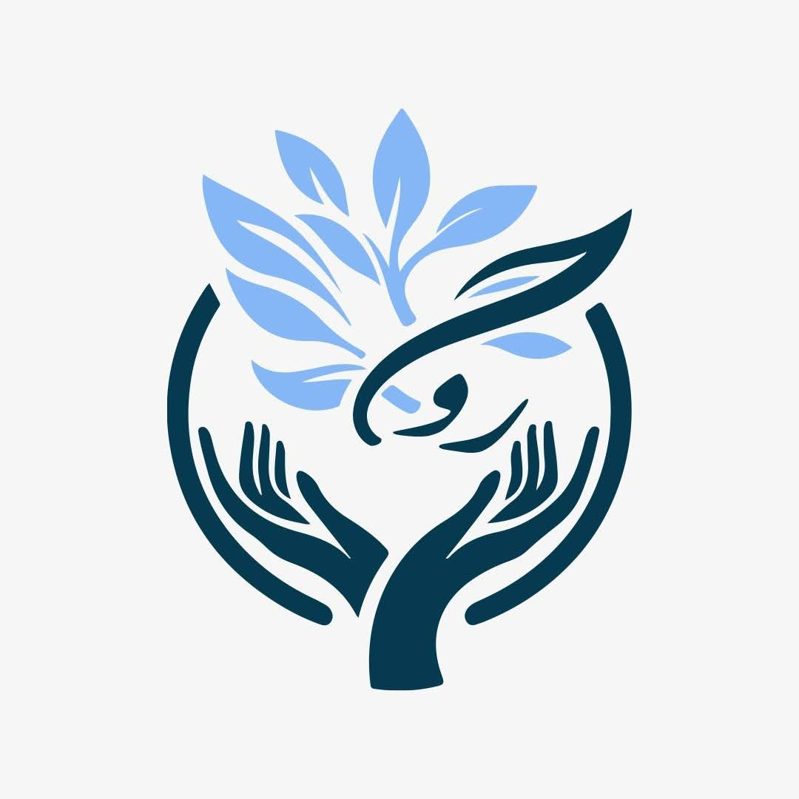

<!DOCTYPE html>
<html lang="ar" dir="rtl">
<head>
    <meta charset="UTF-8">
    <meta name="viewport" content="width=device-width, initial-scale=1.0">
    <title>مستشفى روح الحياة الطبي</title>
    <link rel="stylesheet" href="https://cdnjs.cloudflare.com/ajax/libs/font-awesome/6.5.1/css/all.min.css">
    
</head>
<body>
    
<i class="fas fa-map-marker-alt"></i> شارع الخليج مجاور البوابة العزيزية

    <header><nav>
<h1>مستشفى روح الحياة الطبي</h1>
<ul class="nav-links"><li><a href="#home">الرئيسية</a></li><li><a href="#about">من نحن</a></li><li><a href="#departments">الأقسام الطبية</a></li><li><a href="#offers">العروض</a></li><li><a href="#contact">تواصل معنا</a></li></ul></nav></header>
    <section class="hero" id="home">
<h2>مستشفى روح الحياة الطبي</h2>
رعايتكم هي رسالتنا
<a href="#contact" class="btn">احجز موعدك الآن</a>
</section>
    

<i class="fas fa-tag"></i> خصم 30% على تنظيف الأسنان<i class="fas fa-star"></i> عروض البوتوكس والفلر تبدأ من 500,000 د.ع<i class="fas fa-eye"></i> فحص العيون مجاني كل خميس<i class="fas fa-heartbeat"></i> باقة فحص شامل للجسم بخصم 25%<i class="fas fa-bolt"></i> جلسات الليزر الكامل بأسعار مميزة

    

        <section id="about" class="about"><h2 class="section-title">من نحن</h2>
نقدم أفضل الخدمات الطبية بأحدث التقنيات وأمهر الكوادر

تأسس <strong>مستشفى روح الحياة الطبي</strong> ليكون صرحًا طبيًا متكاملاً يخدم أهالي العزيزية وواسط. رؤيتنا أن نكون الخيار الأول للرعاية الصحية المتميزة، ورسالتنا تقديم خدمات طبية آمنة وعالية الجودة باستخدام أحدث الأجهزة وبأيدي نخبة من الأطباء الاستشاريين.

<i class="fas fa-bullseye"></i><h3>رؤيتنا</h3>
الريادة في الرعاية الصحية المتكاملة

<i class="fas fa-hand-holding-heart"></i><h3>رسالتنا</h3>
صحة المريض أولويتنا القصوى

<i class="fas fa-award"></i><h3>قيمنا</h3>
الجودة، الثقة، الرحمة، الابتكار

</section>
        <section id="departments"><h2 class="section-title">الأقسام الطبية</h2>
نخبة من التخصصات الطبية تحت سقف واحد

            

<i class="fas fa-tooth"></i><h3>قسم الأسنان</h3>

<ul class="service-list"><li><i class="fas fa-check"></i> تقويم الأسنان <button class="btn" style="padding: 6px 15px; font-size: 13px;" onclick="openModal('تقويم الأسنان')">نتائج العلاج</button></li><li><i class="fas fa-check"></i> حشوات تجميلية <button class="btn" style="padding: 6px 15px; font-size: 13px;" onclick="openModal('الحشوات التجميلية')">نتائج العلاج</button></li><li><i class="fas fa-check"></i> تصميم الابتسامة <button class="btn" style="padding: 6px 15px; font-size: 13px;" onclick="openModal('تصميم الابتسامة')">نتائج العلاج</button></li></ul>

            

<i class="fas fa-spa"></i><h3>قسم التجميل</h3>

<ul class="service-list"><li><i class="fas fa-check"></i> تنظيف البشرة <button class="btn" style="padding: 6px 15px; font-size: 13px;" onclick="openModal('تنظيف البشرة')">نتائج العلاج</button></li><li><i class="fas fa-check"></i> تجميل الأنف <button class="btn" style="padding: 6px 15px; font-size: 13px;" onclick="openModal('تجميل الأنف')">نتائج العلاج</button></li><li><i class="fas fa-check"></i> الفلر <button class="btn" style="padding: 6px 15px; font-size: 13px;" onclick="openModal('الفلر')">نتائج العلاج</button></li><li><i class="fas fa-check"></i> البوتوكس <button class="btn" style="padding: 6px 15px; font-size: 13px;" onclick="openModal('البوتوكس')">نتائج العلاج</button></li><li><i class="fas fa-check"></i> قص الأجفان <button class="btn" style="padding: 6px 15px; font-size: 13px;" onclick="openModal('قص الأجفان')">نتائج العلاج</button></li><li><i class="fas fa-check"></i> شفط الدهون <button class="btn" style="padding: 6px 15px; font-size: 13px;" onclick="openModal('شفط الدهون')">نتائج العلاج</button></li></ul>

            

<i class="fas fa-bolt"></i><h3>قسم الليزر</h3>كادر رجالي ونسائي

<ul class="service-list"><li><i class="fas fa-check"></i> ليزر الرقبة <button class="btn" style="padding: 6px 15px; font-size: 13px;" onclick="openModal('ليزر الرقبة')">نتائج العلاج</button></li><li><i class="fas fa-check"></i> ليزر كامل للجسم <button class="btn" style="padding: 6px 15px; font-size: 13px;" onclick="openModal('ليزر كامل')">نتائج العلاج</button></li><li><i class="fas fa-check"></i> ليزر الوجه <button class="btn" style="padding: 6px 15px; font-size: 13px;" onclick="openModal('ليزر الوجه')">نتائج العلاج</button></li></ul>

            

<i class="fas fa-eye"></i><h3>قسم العيون</h3>

<ul class="service-list"><li><i class="fas fa-check"></i> فحص النظر <button class="btn" style="padding: 6px 15px; font-size: 13px;" onclick="openModal('فحص النظر')">نتائج العلاج</button></li><li><i class="fas fa-check"></i> عمليات الليزك <button class="btn" style="padding: 6px 15px; font-size: 13px;" onclick="openModal('الليزك')">نتائج العلاج</button></li><li><i class="fas fa-check"></i> علاج الماء الأبيض <button class="btn" style="padding: 6px 15px; font-size: 13px;" onclick="openModal('الماء الأبيض')">نتائج العلاج</button></li></ul>

            

<i class="fas fa-heartbeat"></i><h3>قسم الباطنية</h3>

<ul class="service-list"><li><i class="fas fa-check"></i> أمراض القلب <button class="btn" style="padding: 6px 15px; font-size: 13px;" onclick="openModal('أمراض القلب')">نتائج العلاج</button></li><li><i class="fas fa-check"></i> السكري والغدد <button class="btn" style="padding: 6px 15px; font-size: 13px;" onclick="openModal('السكري')">نتائج العلاج</button></li><li><i class="fas fa-check"></i> الجهاز الهضمي <button class="btn" style="padding: 6px 15px; font-size: 13px;" onclick="openModal('الجهاز الهضمي')">نتائج العلاج</button></li></ul>

        
</section>
        <section id="contact" class="contact"><h2 class="section-title">تواصل معنا</h2>
نحن هنا لخدمتكم على مدار الساعة

<i class="fas fa-phone"></i><h3>اتصل بنا</h3>
07XX XXX XXXX

طوارئ: 07XX XXX XXXX

<i class="fas fa-map-marker-alt"></i><h3>العنوان</h3>
شارع الخليج

مجاور البوابة العزيزية - واسط

<i class="fas fa-clock"></i><h3>أوقات العمل</h3>
العيادات: 8 صباحًا - 10 مساءً

الطوارئ: 24 ساعة

</section>
    

    <footer>
&copy; 2026 مستشفى روح الحياة الطبي. جميع الحقوق محفوظة.

شارع الخليج مجاور البوابة العزيزية - العزيزية، واسط
</footer>
    

&times;<h2 id="modalTitle" style="color: #0d47a1; margin-bottom: 20px;"></h2>
صور قبل وبعد العلاج - نتائج حقيقية من مرضانا

<i class="fas fa-image" style="font-size: 64px; color: #ccc;"></i>
يتم إضافة صور النتائج هنا

<button class="btn" style="margin-top: 20px; width: 100%;" onclick="closeModal()">إغلاق</button>

    
</body>
</html>
